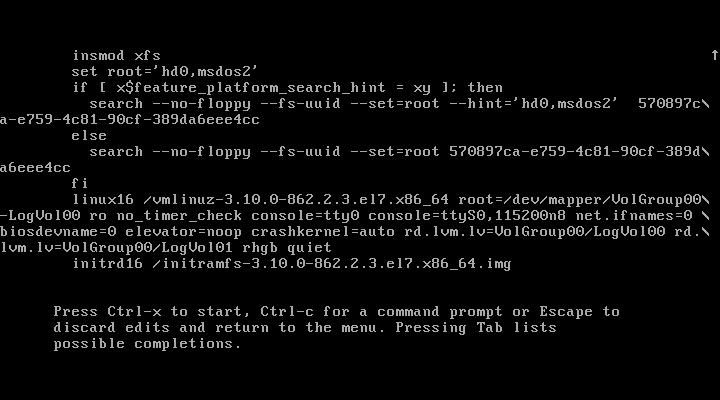
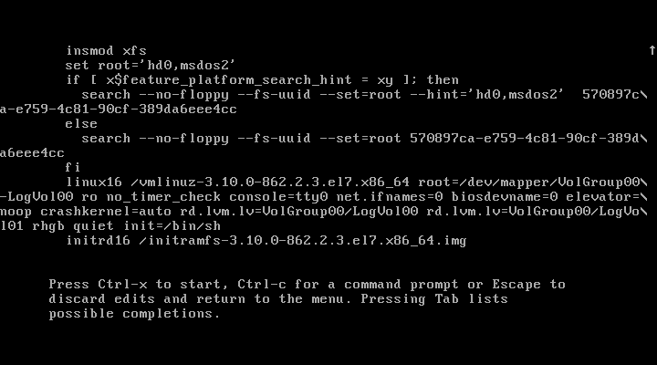
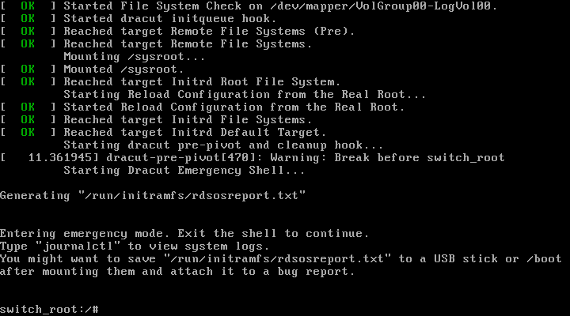
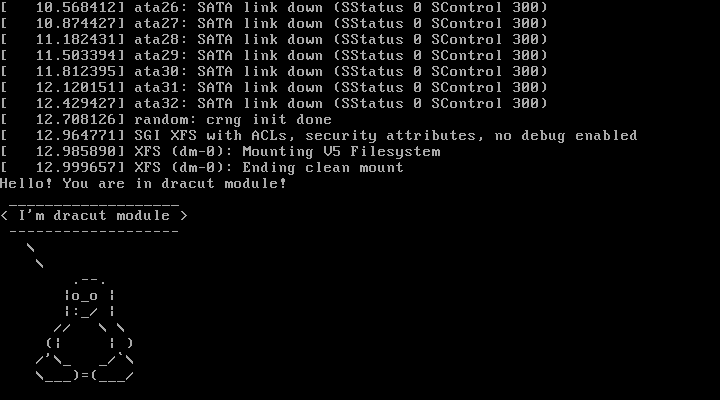

# Домашнее задание 4

#### [лог переименования VG](typescript)
#### [лог добавления модуля](typescript2)

## Работа с загрузчиком

* Попасть в систему без пароля несколькими способами
* Установить систему с LVM, после чего переименовать VG
* Добавить модуль в initrd

## Процесс решения

### Попасть в систему без пароля несколькими способами

Во время перезапуска, при появлении меню выбора ядра нажимаю "e", попадаю в редактор опций загрузчика

#### Способ 1

Перехожу в строку "linux16"

из нее убираю опцию "console=ttyS0,115200n8"

в конец добавляю "init=/bin/sh"

нажимаю ctrl-x и после загрузки получаю консоль

ввожу

	mount -o remount,rw /

получаю доступ на запись к ФС

	touch /root/file

	rm file

#### Способ 2

Перехожу в строку linux16

из нее убираю опцию console=ttyS0,115200n8

в конец добавляю rd.break

нажимаю ctrl-x и после загрузки получаю консоль

#### Способ 3

### Установить систему с LVM, после чего переименовать VG

### Добавить модуль в initrd

